# CLAUDE.md

This file provides guidance to Claude Code (claude.ai/code) when working with code in this repository.

## 变更日志 (Changelog)

### 2025-08-28 10:12:51
- **[AI架构扫描]** 完成完整的项目架构分析和模块识别
- **[安全增强]** 新增安全管理模块和会话管理功能
- **[Steam认证]** 完善Steam OpenID认证工具和回调处理
- **[应用配置]** 添加生产环境配置管理和验证系统
- **[模块文档]** 更新模块结构图和详细的依赖关系分析

### 2025-08-25 14:48:43
- **[AI初始化]** 自动生成项目架构文档和模块索引
- **[模块分析]** 完成Steam登录模块、API接口模块、用户状态管理模块的架构分析
- **[文档完善]** 添加模块结构图和详细的组件依赖关系

## 项目概述

这是一个基于 Vue 3 + TypeScript 的现代化 Web 应用，为【茶】社游戏社区开发的前端项目。项目使用 Naive UI 作为组件库，提供服务器信息展示、排行榜、Steam登录认证等功能。

## 架构概览

### 技术架构
- **前端框架**: Vue 3 + Composition API + TypeScript
- **UI组件库**: Naive UI (专业级Vue组件库) 
- **状态管理**: Pinia (Vue官方状态管理库)
- **路由系统**: Vue Router 4 (支持动态路由和懒加载)
- **构建工具**: Vite (快速现代化构建工具)
- **HTTP客户端**: Axios (统一API请求管理)
- **动画库**: GSAP (高性能动画)
- **认证系统**: Steam OpenID 集成
- **安全机制**: CSRF保护、会话指纹、安全存储

### 核心特性
- Steam用户登录与身份认证
- 实时服务器信息展示与玩家统计
- 响应式用户界面设计
- 模块化组件架构
- 统一的API接口管理
- 动态配置系统与环境变量管理
- 安全会话管理与持久化
- 生产环境错误处理与监控

## 模块结构图

```mermaid
graph TD
    A["(根目录) TeaHvh-Web"] --> B["src/"];
    B --> C["api/ (API接口模块)"];
    B --> D["components/ (组件模块)"];
    B --> E["stores/ (状态管理)"];
    B --> F["views/ (页面视图)"];
    B --> G["utils/ (工具函数)"];
    B --> H["types/ (类型定义)"];
    B --> I["layouts/ (布局组件)"];
    B --> J["router/ (路由配置)"];
    
    C --> C1["user.ts (用户API)"];
    C --> C2["server.ts (服务器API)"];
    C --> C3["announcement.ts (公告API)"];
    C --> C4["levelrank.ts (排行API)"];
    
    D --> D1["auth/ (认证组件)"];
    D --> D2["home/ (首页组件)"];
    D --> D3["servers/ (服务器组件)"];
    D --> D4["icons/ (图标组件)"];
    D --> D5["demo/ (演示组件)"];
    
    D1 --> D11["SteamLogin.vue"];
    D1 --> D12["UserInfo.vue"];
    
    E --> E1["user.ts (用户状态)"];
    E --> E2["index.ts (状态入口)"];
    
    F --> F1["Home.vue"];
    F --> F2["Servers.vue"];
    F --> F3["SteamCallback.vue"];
    
    G --> G1["request.ts (请求封装)"];
    G --> G2["appConfig.ts (应用配置)"];
    G --> G3["steamAuth.ts (Steam认证)"];
    G --> G4["security.ts (安全管理)"];
    G --> G5["session.ts (会话管理)"];

    click C1 "./src/api/CLAUDE.md" "查看用户API模块文档"
    click D1 "./src/components/auth/CLAUDE.md" "查看认证组件模块文档"
    click E1 "./src/stores/CLAUDE.md" "查看状态管理模块文档"
    click G1 "./src/utils/CLAUDE.md" "查看工具函数模块文档"
```



## 模块索引

| 模块路径 | 模块职责 | 核心文件 | 说明 |
|---------|---------|---------|------|
| `src/api/` | API接口管理 | `user.ts`, `server.ts`, `announcement.ts`, `levelrank.ts` | 统一管理后端API调用，包含用户认证、服务器信息、公告、排行等接口 |
| `src/components/auth/` | 用户认证组件 | `SteamLogin.vue`, `UserInfo.vue` | Steam登录组件和用户信息显示组件 |
| `src/components/home/` | 首页组件集合 | `Banner.vue`, `HomeServersSection.vue`, `FeatureSection.vue` | 首页各功能区块组件 |
| `src/components/servers/` | 服务器相关组件 | `ServerCard.vue` | 服务器信息卡片组件 |
| `src/stores/` | 状态管理 | `user.ts`, `index.ts` | Pinia状态管理，用户登录状态和信息管理 |
| `src/utils/` | 工具函数 | `request.ts`, `appConfig.ts`, `steamAuth.ts`, `security.ts`, `session.ts` | HTTP请求封装、配置管理、Steam认证、安全工具 |
| `src/views/` | 页面视图 | `Home.vue`, `Servers.vue`, `SteamCallback.vue`, `Ranking.vue` | 主要页面组件 |
| `src/layouts/` | 布局组件 | `DefaultLayout.vue` | 全局布局结构 |
| `src/router/` | 路由配置 | `index.ts` | Vue Router路由定义 |
| `src/types/` | 类型定义 | `config.ts` | TypeScript类型定义 |

## 运行和开发

### 环境要求
- Node.js >= 16.0.0
- npm >= 8.0.0

### 开发命令
```bash
# 安装依赖
npm install

# 开发环境启动 (http://localhost:5173)
npm run dev

# 生产环境构建
npm run build

# 预览构建结果
npm run preview
```

### 环境变量配置
```bash
# API配置
VITE_API_BASE_URL=https://api.teahvh.cc/api
VITE_SITE_URL=https://www.teahvh.cc

# Steam配置
VITE_STEAM_API_KEY=你的Steam_API密钥
VITE_STEAM_APP_NAME=TeaHvh Gaming Community
VITE_STEAM_REALM=https://www.teahvh.cc
VITE_STEAM_RETURN_URL=https://www.teahvh.cc/steam-callback

# 安全配置
VITE_SESSION_KEY=你的会话密钥
VITE_FINGERPRINT_KEY=teahvh-fingerprint
VITE_SESSION_EXPIRE_HOURS=168

# 功能开关
VITE_DEVTOOLS_ENABLED=false
VITE_DEBUG_MODE=false
VITE_PERFORMANCE_MONITORING=true
VITE_PWA_ENABLED=false

# 监控配置
VITE_GA_MEASUREMENT_ID=你的GA_ID
VITE_SENTRY_DSN=你的Sentry_DSN
```

## 测试策略

### 开发环境测试
- Steam登录功能在开发环境下提供模拟登录功能
- API接口支持开发模式下的Mock数据
- 实时服务器状态监控
- 配置验证和安全检查

### 功能测试重点
1. **Steam登录流程**：OpenID认证和回调处理
2. **用户状态管理**：登录状态持久化和自动恢复
3. **服务器信息显示**：实时数据获取和展示
4. **响应式设计**：多设备兼容性测试
5. **安全机制**：CSRF保护、会话管理、指纹验证

## 编码标准

### Vue组件规范
- 使用 Composition API 和 `<script setup>` 语法
- 组件文件使用 PascalCase 命名
- 组件放置在对应功能模块目录下
- 使用TypeScript进行类型约束
- 遵循单一职责原则

### API接口规范
- 统一使用 `src/utils/request.ts` 进行HTTP请求
- API接口按功能模块分类组织
- 支持请求/响应拦截器和统一错误处理
- Bearer Token认证方式
- 开发环境Mock数据支持

### 状态管理规范
- 使用Pinia进行状态管理
- 状态按功能模块划分
- 支持状态持久化和恢复
- 计算属性优化性能
- 安全会话管理

### 安全编码规范
- 使用CSRF Token保护
- 会话指纹验证
- 安全的本地存储管理
- 输入验证和输出编码
- 错误信息安全处理

## AI使用指南

### 开发重点关注
1. **Steam登录集成**：重点理解OpenID认证流程和回调处理机制
2. **API接口管理**：熟悉统一的HTTP请求封装和错误处理
3. **组件模块化**：理解Vue 3组件架构和Naive UI集成
4. **状态管理**：掌握Pinia状态管理和用户认证状态
5. **安全机制**：了解CSRF保护和会话管理
6. **配置系统**：熟悉环境变量和动态配置管理

### 常用开发场景
- 新增API接口：在对应模块的API文件中定义接口函数
- 创建新组件：按功能归类到对应的components子目录
- 添加新页面：在views目录创建页面组件并配置路由
- 修改配置：更新环境变量或 `src/utils/appConfig.ts`
- Steam认证：使用 `src/utils/steamAuth.ts` 工具类
- 安全功能：使用 `src/utils/security.ts` 和 `src/utils/session.ts`

### 代码最佳实践
- 遵循KISS、YAGNI、DRY、SOLID原则
- 优先使用Composition API和TypeScript类型系统
- 保持组件单一职责和良好的代码可读性
- 统一错误处理和用户体验优化
- 注重安全性和性能优化
- 完善的配置验证和环境适配

## 变更日志 (Changelog)

### 历史变更
- **2025-08-28**: 架构优化，添加安全机制、配置管理、Steam认证工具
- **2025-08-25**: 项目架构初始化完成，Steam登录功能实现
- **持续更新**: 根据需求迭代和功能完善